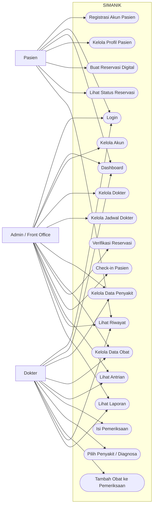
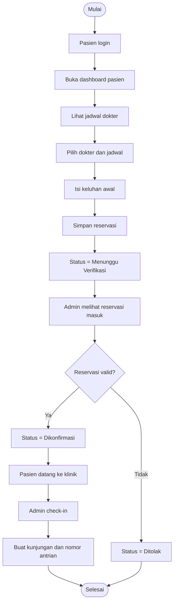
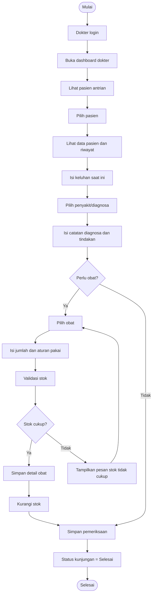
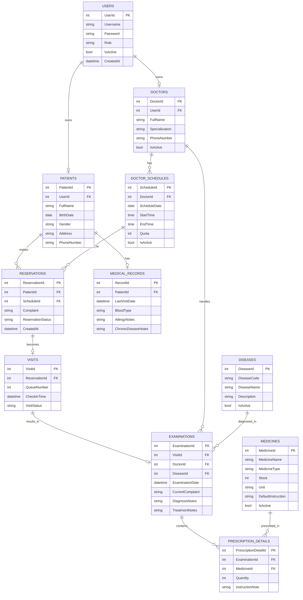
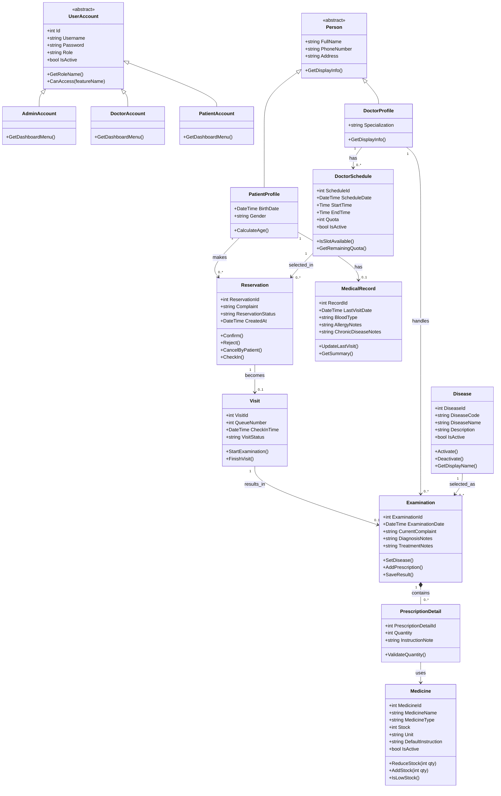
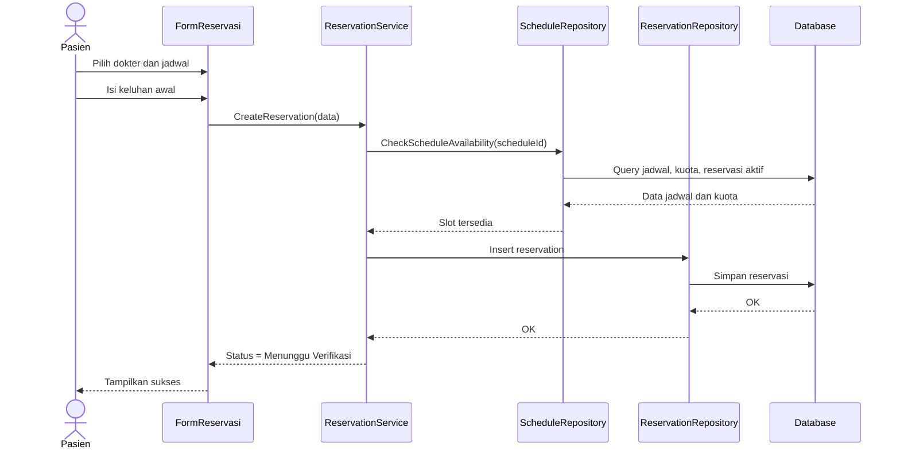
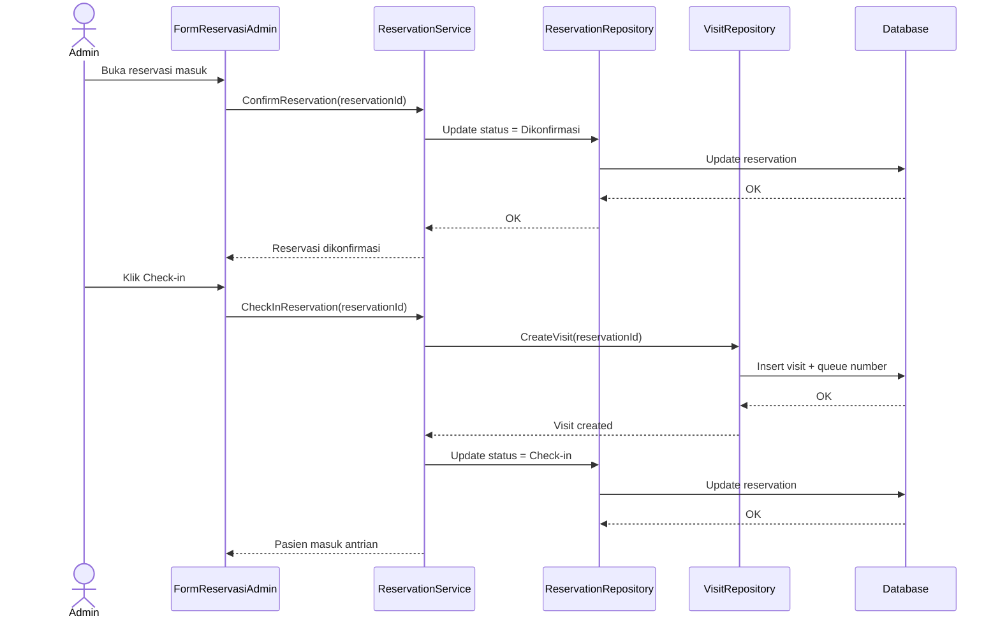
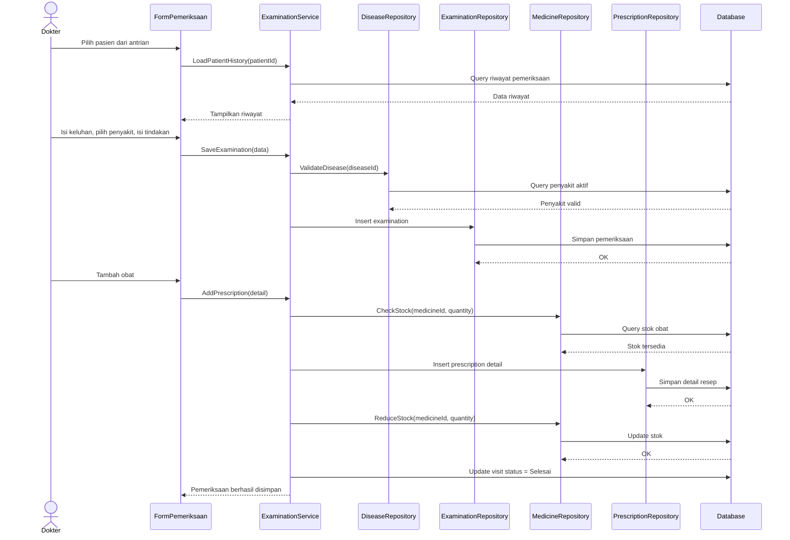
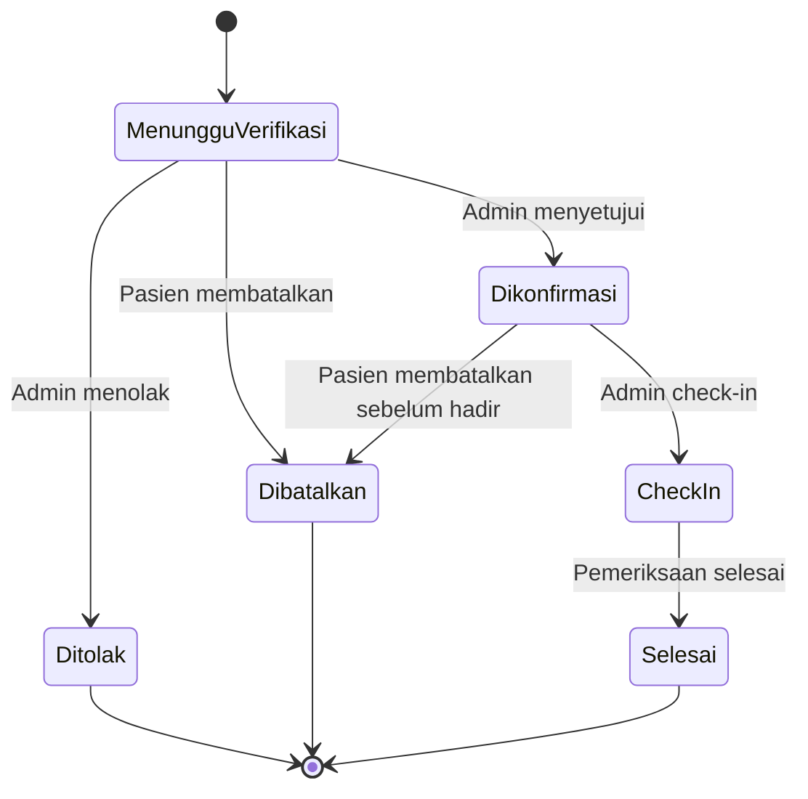
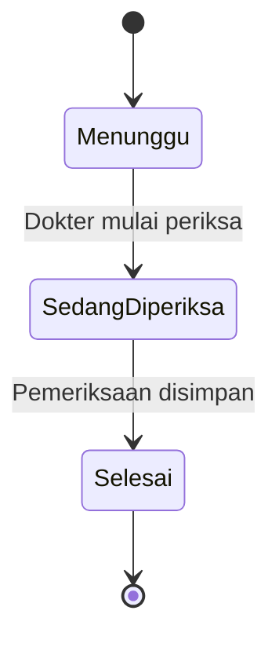

# PRD — Sistem Informasi dan Manajemen Klinik (SIMANIK)

**Platform:** Desktop App C# menggunakan Visual Studio + Windows Forms
**Database:** SQL Server LocalDB atau MySQL
**Tema UI:** Biru muda, bersih, modern, dan nyaman untuk aplikasi kesehatan
**Role:** Admin, Dokter, Pasien

---

# 1. Ringkasan Produk

## 1.1 Nama Produk

**SIMANIK — Sistem Informasi dan Manajemen Klinik**

## 1.2 Jenis Produk

SIMANIK adalah aplikasi desktop untuk manajemen operasional klinik dan reservasi digital. Sistem ini membantu pasien melakukan reservasi, admin mengelola data dan antrian, dokter melakukan pemeriksaan, serta seluruh pengguna mendapatkan informasi melalui dashboard sesuai role.

## 1.3 Tujuan Utama

Membangun sistem klinik yang memungkinkan:

1. Pasien membuat reservasi digital sebelum datang ke klinik.
2. Admin/front office mengelola data pasien, dokter, jadwal, reservasi, kunjungan, obat, dan laporan.
3. Dokter melihat antrian, melihat riwayat pasien, mengisi pemeriksaan, memilih penyakit/diagnosa, dan memberikan obat.
4. Sistem menampilkan output informasi yang mudah dibaca melalui dashboard untuk Admin, Dokter, dan Pasien.
5. Data klinik tersimpan secara terstruktur, saling berelasi, dan realistis untuk proyek C# Windows Forms berbasis OOP.

---

# 2. Latar Belakang

Pada banyak klinik kecil, proses administrasi masih sering dilakukan secara manual. Contohnya:

* pendaftaran pasien,
* pengaturan jadwal dokter,
* reservasi kunjungan,
* pencatatan keluhan dan pemeriksaan,
* pencatatan diagnosa/penyakit,
* pemberian obat,
* pencarian riwayat pasien,
* pemantauan stok obat,
* pembuatan laporan sederhana.

Masalah yang sering terjadi:

* data pasien tercecer,
* pencarian riwayat lambat,
* status reservasi tidak jelas,
* antrian tidak tertata,
* dokter sulit melihat riwayat pasien,
* admin sulit melihat kondisi operasional harian,
* pasien tidak mendapat informasi status reservasi secara jelas.

Karena itu, SIMANIK dibuat untuk memberikan sistem sederhana tetapi lengkap, dengan alur end-to-end:

**pasien reservasi → admin verifikasi/check-in → dokter periksa → sistem menyimpan riwayat dan laporan.**

---

# 3. Visi Produk

Menyediakan aplikasi desktop manajemen klinik yang:

* mudah digunakan oleh admin, dokter, dan pasien,
* memiliki dashboard informatif sesuai role,
* mendukung reservasi digital,
* menyimpan data penyakit/diagnosa secara terstruktur,
* memiliki database berelasi yang jelas,
* menerapkan konsep OOP,
* cukup lengkap untuk presentasi, tetapi tetap realistis untuk dikerjakan oleh tim mahasiswa.

---

# 4. Tujuan Produk

## 4.1 Tujuan Operasional

* Memudahkan pasien membuat reservasi digital.
* Memudahkan admin memverifikasi reservasi dan mengatur check-in.
* Memudahkan dokter melihat pasien hari ini dan mengisi hasil pemeriksaan.
* Menyimpan data penyakit/diagnosa secara rapi.
* Menyediakan riwayat pemeriksaan pasien.
* Memantau stok obat.
* Menyediakan dashboard dan laporan sederhana untuk pengambilan keputusan.

## 4.2 Tujuan Akademik

Menjadi proyek yang kuat untuk menunjukkan konsep:

* Encapsulation,
* Inheritance,
* Polymorphism,
* Abstraction,
* Association,
* Composition,
* relasi database,
* role-based access control,
* dashboard berbasis data.

---

# 5. Ruang Lingkup Sistem

## 5.1 Yang Termasuk dalam Sistem

1. Registrasi akun pasien.
2. Login multi-role.
3. Dashboard berdasarkan role.
4. Manajemen akun user.
5. Manajemen data dokter.
6. Manajemen jadwal dokter.
7. Manajemen profil pasien.
8. Reservasi digital/online.
9. Verifikasi reservasi oleh admin.
10. Check-in pasien.
11. Kunjungan/antrian pasien.
12. Pemeriksaan pasien oleh dokter.
13. Master data penyakit.
14. Pemilihan penyakit/diagnosa pada pemeriksaan.
15. Master data obat.
16. Resep atau obat yang diberikan.
17. Medical record/ringkasan medis pasien.
18. Riwayat reservasi.
19. Riwayat pemeriksaan.
20. Dashboard output informasi untuk Admin, Dokter, dan Pasien.
21. Laporan sederhana.

## 5.2 Yang Tidak Termasuk dalam Sistem

1. Pembayaran online.
2. Integrasi BPJS.
3. Integrasi laboratorium.
4. Notifikasi WhatsApp/SMS.
5. Tanda tangan digital.
6. Multi-cabang klinik.
7. Aplikasi mobile native.
8. Sinkronisasi cloud publik.
9. Telemedicine/video call.
10. Rekam medis kompleks seperti rumah sakit besar.

---

# 6. Role Pengguna

## 6.1 Admin / Front Office

Admin bertanggung jawab terhadap operasional harian klinik.

### Tugas Utama Admin

* Login ke sistem.
* Mengelola akun user.
* Mengelola data dokter.
* Mengelola jadwal dokter.
* Mengelola data pasien.
* Mengelola master data penyakit.
* Mengelola master data obat.
* Memverifikasi reservasi pasien.
* Mencatat kedatangan/check-in pasien.
* Memantau antrian.
* Melihat dashboard operasional.
* Melihat laporan.

## 6.2 Dokter

Dokter bertanggung jawab terhadap pelayanan medis pasien.

### Tugas Utama Dokter

* Login ke sistem.
* Melihat dashboard dokter.
* Melihat jadwal praktik hari ini.
* Melihat daftar pasien dalam antrian.
* Melihat detail pasien.
* Melihat riwayat pemeriksaan pasien.
* Mengisi hasil pemeriksaan.
* Memilih penyakit/diagnosa utama.
* Menambahkan catatan diagnosa dan tindakan.
* Memilih obat yang diberikan.
* Menyelesaikan pemeriksaan.

## 6.3 Pasien

Pasien adalah pengguna eksternal yang memakai sistem untuk reservasi dan melihat informasi pribadinya.

### Tugas Utama Pasien

* Registrasi akun.
* Login.
* Mengelola profil.
* Melihat jadwal dokter.
* Membuat reservasi digital.
* Melihat status reservasi.
* Membatalkan reservasi sebelum check-in.
* Melihat dashboard pasien.
* Melihat riwayat reservasi.
* Melihat riwayat pemeriksaan sederhana.
* Melihat obat yang pernah diberikan.

---

# 7. Matriks Hak Akses

| Fitur                      | Admin |                  Dokter |               Pasien |
| -------------------------- | ----: | ----------------------: | -------------------: |
| Registrasi akun pasien     | Tidak |                   Tidak |                   Ya |
| Login                      |    Ya |                      Ya |                   Ya |
| Dashboard                  |    Ya |                      Ya |                   Ya |
| Kelola akun user           |    Ya |                   Tidak |                Tidak |
| Kelola data dokter         |    Ya |                   Tidak |                Tidak |
| Kelola jadwal dokter       |    Ya |                   Tidak |                Tidak |
| Kelola data pasien         |    Ya |                Terbatas |         Data sendiri |
| Kelola data penyakit       |    Ya |                   Lihat |                Tidak |
| Kelola data obat           |    Ya |                   Lihat |                Tidak |
| Buat reservasi             | Tidak |                   Tidak |                   Ya |
| Lihat reservasi sendiri    | Tidak |                   Tidak |                   Ya |
| Batalkan reservasi sendiri | Tidak |                   Tidak | Ya, sebelum check-in |
| Lihat semua reservasi      |    Ya |                   Tidak |                Tidak |
| Verifikasi reservasi       |    Ya |                   Tidak |                Tidak |
| Check-in pasien            |    Ya |                   Tidak |                Tidak |
| Lihat antrian hari ini     |    Ya |                      Ya |                Tidak |
| Isi pemeriksaan            | Tidak |                      Ya |                Tidak |
| Pilih penyakit/diagnosa    | Tidak |                      Ya |                Tidak |
| Tambah obat ke pemeriksaan | Tidak |                      Ya |                Tidak |
| Lihat riwayat pasien       |    Ya | Ya, pasien yang relevan |      Riwayat sendiri |
| Lihat laporan              |    Ya |                Terbatas |                Tidak |

---

# 8. Gambaran Umum Alur Sistem

1. Pasien registrasi akun.
2. Pasien login.
3. Pasien melihat jadwal dokter.
4. Pasien membuat reservasi digital.
5. Sistem menyimpan reservasi dengan status **Menunggu Verifikasi**.
6. Admin membuka dashboard dan melihat reservasi masuk.
7. Admin menyetujui atau menolak reservasi.
8. Jika disetujui, status berubah menjadi **Dikonfirmasi**.
9. Saat pasien datang, admin melakukan check-in.
10. Sistem membuat data kunjungan dan nomor antrian.
11. Dokter melihat dashboard dan daftar pasien menunggu.
12. Dokter membuka data pasien dan riwayat.
13. Dokter mengisi pemeriksaan.
14. Dokter memilih penyakit/diagnosa utama.
15. Dokter menambahkan obat jika diperlukan.
16. Sistem menyimpan pemeriksaan dan mengurangi stok obat.
17. Status kunjungan menjadi **Selesai**.
18. Pasien dapat melihat riwayat pemeriksaan.
19. Admin dapat melihat laporan operasional.

---

# 9. Fitur Utama Sistem

## 9.1 Registrasi dan Login

### Deskripsi

Fitur untuk autentikasi user dan pengalihan dashboard berdasarkan role.

### Subfitur

* Registrasi akun pasien.
* Login Admin, Dokter, dan Pasien.
* Logout.
* Validasi username dan password.
* Validasi akun aktif/nonaktif.
* Pengalihan ke dashboard sesuai role.

---

## 9.2 Dashboard Berdasarkan Role

Dashboard menjadi output informasi utama sistem. Setiap role melihat informasi yang berbeda sesuai kebutuhan.

---

### 9.2.1 Dashboard Admin

#### Tujuan

Memberikan gambaran cepat tentang operasional klinik hari ini.

#### Informasi yang Ditampilkan

**A. Summary Cards**

1. Total pasien.
2. Total dokter aktif.
3. Total reservasi hari ini.
4. Reservasi menunggu verifikasi.
5. Pasien check-in hari ini.
6. Pemeriksaan selesai hari ini.
7. Obat stok rendah.
8. Penyakit paling banyak bulan ini.

**B. Tabel Cepat**

1. Reservasi terbaru.
2. Antrian hari ini.
3. Obat stok rendah.
4. Jadwal dokter hari ini.

**C. Statistik Sederhana**

1. Jumlah reservasi per hari.
2. Jumlah pasien per dokter.
3. Penyakit paling sering ditemukan.
4. Obat paling sering diberikan.

**D. Alert / Notifikasi Internal**

1. Ada reservasi belum diverifikasi.
2. Ada obat di bawah batas stok minimum.
3. Ada jadwal dokter hari ini.

#### Output Dashboard Admin

| Komponen            | Sumber Data            | Bentuk Tampilan    |
| ------------------- | ---------------------- | ------------------ |
| Total pasien        | patients               | Card angka         |
| Total dokter aktif  | doctors                | Card angka         |
| Reservasi hari ini  | reservations           | Card angka         |
| Belum diverifikasi  | reservations           | Card angka + alert |
| Pasien check-in     | visits                 | Card angka         |
| Pemeriksaan selesai | examinations, visits   | Card angka         |
| Stok obat rendah    | medicines              | Table              |
| Penyakit terbanyak  | diseases, examinations | Chart/Table        |

---

### 9.2.2 Dashboard Dokter

#### Tujuan

Membantu dokter fokus pada pasien yang harus diperiksa hari ini.

#### Informasi yang Ditampilkan

**A. Summary Cards**

1. Jadwal praktik hari ini.
2. Jumlah pasien menunggu.
3. Jumlah pasien sedang diperiksa.
4. Jumlah pemeriksaan selesai.

**B. Tabel Utama**

Daftar pasien hari ini:

* nomor antrian,
* nama pasien,
* keluhan awal,
* status kunjungan,
* tombol detail/periksa.

**C. Informasi Pendukung**

1. Riwayat pemeriksaan pasien yang dipilih.
2. Diagnosa/penyakit sebelumnya.
3. Obat yang pernah diberikan.

#### Output Dashboard Dokter

| Komponen            | Sumber Data                                  | Bentuk Tampilan |
| ------------------- | -------------------------------------------- | --------------- |
| Jadwal hari ini     | doctor_schedules                             | Card/List       |
| Pasien menunggu     | visits, reservations                         | Card angka      |
| Pemeriksaan selesai | examinations                                 | Card angka      |
| Daftar antrian      | visits, patients                             | DataGridView    |
| Riwayat pasien      | examinations, diseases, prescription_details | Detail panel    |

---

### 9.2.3 Dashboard Pasien

#### Tujuan

Memberikan informasi pribadi pasien dengan tampilan sederhana dan mudah dipahami.

#### Informasi yang Ditampilkan

**A. Profile Card**

1. Nama pasien.
2. Nomor pasien.
3. Umur.
4. Nomor telepon.

**B. Reservasi**

1. Reservasi terdekat.
2. Dokter yang dipilih.
3. Jadwal reservasi.
4. Status reservasi.
5. Tombol batal jika belum check-in.

**C. Riwayat**

1. Riwayat reservasi.
2. Kunjungan terakhir.
3. Diagnosa/penyakit terakhir.
4. Obat terakhir yang diberikan.

#### Output Dashboard Pasien

| Komponen           | Sumber Data                     | Bentuk Tampilan |
| ------------------ | ------------------------------- | --------------- |
| Profil singkat     | patients                        | Card            |
| Reservasi terdekat | reservations, doctor_schedules  | Card/List       |
| Status reservasi   | reservations                    | Badge warna     |
| Riwayat kunjungan  | visits, examinations            | DataGridView    |
| Obat terakhir      | prescription_details, medicines | List            |

---

## 9.3 Manajemen Akun

Digunakan admin untuk mengelola akun internal dan memantau akun pasien.

### Subfitur

* Tambah akun admin/dokter.
* Ubah akun.
* Nonaktifkan akun.
* Lihat daftar user.
* Cari user.

---

## 9.4 Manajemen Data Dokter

Digunakan admin untuk menyimpan dan mengatur data dokter.

### Data Dokter

* ID dokter.
* User akun.
* Nama lengkap.
* Spesialisasi.
* Nomor telepon.
* Status aktif.

### Subfitur

* Tambah dokter.
* Ubah dokter.
* Nonaktifkan dokter.
* Cari dokter.
* Lihat detail dokter.

---

## 9.5 Manajemen Jadwal Dokter

Digunakan admin untuk mengatur jadwal praktik dokter.

### Data Jadwal

* ID jadwal.
* Dokter.
* Tanggal jadwal.
* Jam mulai.
* Jam selesai.
* Kuota pasien.
* Status aktif.

### Subfitur

* Tambah jadwal.
* Ubah jadwal.
* Hapus/nonaktifkan jadwal.
* Lihat slot tersedia.
* Validasi kuota pasien.

---

## 9.6 Profil Pasien

Digunakan pasien untuk melengkapi identitas.

### Data Pasien

* ID pasien.
* User akun.
* Nama lengkap.
* Tanggal lahir.
* Jenis kelamin.
* Alamat.
* Nomor telepon.

### Subfitur

* Lihat profil.
* Ubah profil.
* Ubah nomor telepon.
* Ubah alamat.
* Lihat nomor pasien.

---

## 9.7 Reservasi Digital

Fitur utama yang memungkinkan pasien memesan jadwal pemeriksaan sebelum datang ke klinik.

### Subfitur

* Lihat daftar dokter.
* Lihat jadwal dokter.
* Pilih jadwal.
* Isi keluhan awal.
* Buat reservasi.
* Lihat status reservasi.
* Batalkan reservasi selama belum check-in.

### Status Reservasi

1. Menunggu Verifikasi.
2. Dikonfirmasi.
3. Ditolak.
4. Dibatalkan Pasien.
5. Check-in.
6. Selesai.

---

## 9.8 Verifikasi Reservasi

Digunakan admin untuk memproses reservasi masuk.

### Subfitur

* Lihat daftar reservasi baru.
* Lihat detail reservasi.
* Konfirmasi reservasi.
* Tolak reservasi.
* Ubah jadwal jika diperlukan.
* Isi alasan penolakan jika ditolak.
* Check-in saat pasien datang.

---

## 9.9 Kunjungan / Antrian

Kunjungan adalah data pasien yang sudah datang dan siap diperiksa.

### Subfitur

* Buat kunjungan dari reservasi check-in.
* Generate nomor antrian sederhana.
* Tampilkan daftar pasien menunggu.
* Tampilkan pasien sedang diperiksa.
* Tampilkan pasien selesai.

### Status Kunjungan

1. Menunggu.
2. Sedang Diperiksa.
3. Selesai.

---

## 9.10 Pemeriksaan Pasien

Digunakan dokter saat melayani pasien.

### Subfitur

* Pilih pasien dari antrian.
* Lihat detail pasien.
* Lihat riwayat pemeriksaan.
* Isi keluhan saat ini.
* Pilih penyakit/diagnosa utama dari master penyakit.
* Isi catatan diagnosa tambahan.
* Isi catatan tindakan.
* Tambahkan obat.
* Simpan pemeriksaan.
* Selesaikan kunjungan.

### Data Pemeriksaan

* ID pemeriksaan.
* Kunjungan.
* Dokter.
* Tanggal pemeriksaan.
* Keluhan saat ini.
* Penyakit/diagnosa utama.
* Catatan diagnosa.
* Catatan tindakan.

---

## 9.11 Manajemen Penyakit

Master data penyakit digunakan agar diagnosa dokter lebih terstruktur.

### Data Penyakit

* ID penyakit.
* Kode penyakit.
* Nama penyakit.
* Deskripsi.
* Status aktif.

### Subfitur

* Tambah penyakit.
* Ubah penyakit.
* Nonaktifkan penyakit.
* Cari penyakit.
* Tampilkan daftar penyakit aktif saat pemeriksaan.

### Contoh Data Penyakit

| Kode | Nama Penyakit     | Deskripsi Singkat                       |
| ---- | ----------------- | --------------------------------------- |
| FLU  | Influenza         | Infeksi saluran pernapasan akibat virus |
| DEM  | Demam             | Peningkatan suhu tubuh                  |
| BAT  | Batuk             | Gejala gangguan saluran pernapasan      |
| HIP  | Hipertensi        | Tekanan darah tinggi                    |
| DIA  | Diabetes Mellitus | Gangguan kadar gula darah               |

---

## 9.12 Manajemen Obat

Digunakan admin untuk menyimpan master data obat.

### Data Obat

* ID obat.
* Nama obat.
* Jenis obat.
* Stok.
* Satuan.
* Aturan pakai default.
* Status aktif.

### Subfitur

* Tambah obat.
* Ubah obat.
* Nonaktifkan obat.
* Cari obat.
* Lihat stok obat.
* Lihat obat stok rendah.

---

## 9.13 Resep / Obat yang Diberikan

Digunakan dokter saat selesai melakukan pemeriksaan.

### Subfitur

* Pilih obat.
* Isi jumlah.
* Isi aturan pakai.
* Tambah lebih dari satu obat.
* Validasi stok.
* Pengurangan stok otomatis.

---

## 9.14 Medical Record / Ringkasan Medis

Medical record adalah ringkasan data medis pasien yang membantu dokter melihat kondisi penting pasien secara cepat.

### Data Medical Record

* ID record.
* Pasien.
* Tanggal kunjungan terakhir.
* Golongan darah.
* Catatan alergi.
* Catatan penyakit kronis.

### Catatan Scope

Medical record pada proyek ini dibuat sederhana. Detail pemeriksaan tetap disimpan di tabel `examinations`. Tabel `medical_records` hanya berfungsi sebagai ringkasan cepat.

---

## 9.15 Riwayat

### Riwayat untuk Pasien

* Riwayat reservasi sendiri.
* Riwayat pemeriksaan sendiri.
* Diagnosa/penyakit yang pernah tercatat.
* Obat yang pernah diberikan.

### Riwayat untuk Dokter

* Riwayat pasien yang sedang diperiksa.
* Pemeriksaan sebelumnya.
* Penyakit/diagnosa sebelumnya.
* Obat sebelumnya.

### Riwayat untuk Admin

* Semua reservasi.
* Semua kunjungan.
* Semua pemeriksaan.
* Data penyakit paling sering.
* Data obat yang sering diberikan.

---

## 9.16 Laporan Sederhana

Laporan cukup berupa DataGridView, filter tanggal, dan ringkasan angka. Export PDF tidak wajib.

### Laporan yang Disarankan

1. Reservasi per hari.
2. Reservasi per dokter.
3. Kunjungan selesai per hari.
4. Jumlah pasien per dokter.
5. Penyakit paling sering ditemukan.
6. Obat paling sering diberikan.
7. Obat stok rendah.
8. Pemeriksaan per periode.

---

# 10. Use Case Utama

## 10.1 Use Case List

1. Registrasi akun pasien.
2. Login.
3. Kelola akun.
4. Kelola dokter.
5. Kelola jadwal dokter.
6. Kelola pasien.
7. Kelola penyakit.
8. Kelola obat.
9. Buat reservasi digital.
10. Verifikasi reservasi.
11. Check-in pasien.
12. Lihat antrian pasien.
13. Isi pemeriksaan.
14. Pilih penyakit/diagnosa.
15. Tambah obat ke pemeriksaan.
16. Lihat riwayat.
17. Lihat dashboard.
18. Lihat laporan.

---

# 11. Diagram Use Case



---

# 12. Alur Kerja Sistem

## 12.1 Alur Reservasi Pasien

1. Pasien membuka aplikasi.
2. Pasien login.
3. Pasien membuka dashboard.
4. Pasien memilih menu jadwal dokter.
5. Pasien memilih dokter dan jadwal.
6. Pasien mengisi keluhan awal.
7. Sistem menyimpan reservasi dengan status **Menunggu Verifikasi**.
8. Admin melihat reservasi masuk pada dashboard admin.
9. Admin menyetujui atau menolak reservasi.
10. Jika disetujui, status menjadi **Dikonfirmasi**.
11. Pasien melihat status reservasi pada dashboard pasien.
12. Saat pasien datang, admin melakukan check-in.
13. Sistem membuat kunjungan dan nomor antrian.

## 12.2 Alur Pemeriksaan

1. Dokter login.
2. Dokter membuka dashboard.
3. Dokter melihat daftar pasien menunggu.
4. Dokter memilih pasien.
5. Dokter melihat detail pasien dan riwayat.
6. Dokter mengisi keluhan saat ini.
7. Dokter memilih penyakit/diagnosa utama.
8. Dokter mengisi catatan diagnosa dan tindakan.
9. Jika perlu obat, dokter memilih obat dan jumlah.
10. Sistem memvalidasi stok obat.
11. Sistem menyimpan pemeriksaan.
12. Sistem menyimpan detail resep.
13. Sistem mengurangi stok obat.
14. Sistem mengubah status kunjungan menjadi **Selesai**.
15. Pasien dapat melihat riwayat pemeriksaan.

## 12.3 Alur Dashboard

1. User login.
2. Sistem membaca role user.
3. Sistem mengambil data sesuai role.
4. Sistem menampilkan summary card, tabel, dan status badge.
5. User memilih detail jika diperlukan.

## 12.4 Alur Laporan

1. Admin membuka menu laporan.
2. Admin memilih filter tanggal, dokter, penyakit, atau obat.
3. Sistem mengambil data dari tabel terkait.
4. Sistem menampilkan laporan dalam bentuk tabel dan ringkasan angka.

---

# 13. Diagram Aktivitas Reservasi Digital



---

# 14. Diagram Aktivitas Pemeriksaan



---

# 15. Kebutuhan Fungsional

## 15.1 Modul Registrasi

* Sistem harus memungkinkan pasien membuat akun baru.
* Sistem harus memvalidasi username unik.
* Sistem harus menyimpan akun dengan role Pasien.
* Sistem harus membuat data profil pasien setelah registrasi.

## 15.2 Modul Login

* Sistem harus menerima username dan password.
* Sistem harus memvalidasi kredensial user.
* Sistem harus mengecek status aktif user.
* Sistem harus mengarahkan user ke dashboard sesuai role.

## 15.3 Modul Dashboard

* Sistem harus menampilkan dashboard berbeda untuk Admin, Dokter, dan Pasien.
* Dashboard Admin harus menampilkan data operasional klinik.
* Dashboard Dokter harus menampilkan jadwal dan antrian pasien.
* Dashboard Pasien harus menampilkan profil, reservasi, dan riwayat.
* Data dashboard harus diambil dari database secara dinamis.

## 15.4 Modul Akun

* Admin dapat menambah akun admin dan dokter.
* Admin dapat mengubah akun.
* Admin dapat menonaktifkan akun.
* Admin dapat melihat daftar akun.

## 15.5 Modul Dokter

* Admin dapat menambah, mengubah, dan menonaktifkan dokter.
* Sistem harus menyimpan spesialisasi dokter.
* Sistem harus menampilkan dokter aktif.

## 15.6 Modul Jadwal Dokter

* Admin dapat menambah jadwal dokter.
* Admin dapat mengubah jadwal dokter.
* Sistem harus menyimpan kuota pasien.
* Reservasi hanya boleh dibuat pada jadwal aktif.
* Sistem harus menolak reservasi jika kuota penuh.

## 15.7 Modul Pasien

* Pasien dapat melihat dan memperbarui profil.
* Admin dapat melihat daftar pasien.
* Dokter dapat melihat pasien yang relevan dengan pemeriksaan.

## 15.8 Modul Reservasi

* Pasien dapat membuat reservasi.
* Reservasi harus terhubung ke pasien dan jadwal dokter.
* Sistem harus menyimpan keluhan awal.
* Admin dapat memverifikasi reservasi.
* Pasien dapat membatalkan reservasi sebelum check-in.

## 15.9 Modul Kunjungan

* Reservasi yang sudah check-in harus menjadi data kunjungan.
* Sistem harus membuat nomor antrian.
* Sistem harus menampilkan daftar antrian.
* Status kunjungan harus dapat berubah dari Menunggu ke Sedang Diperiksa lalu Selesai.

## 15.10 Modul Pemeriksaan

* Dokter dapat memilih kunjungan aktif.
* Dokter dapat mengisi keluhan saat ini.
* Dokter dapat memilih penyakit/diagnosa utama.
* Dokter dapat mengisi catatan diagnosa dan tindakan.
* Pemeriksaan harus terhubung ke kunjungan dan dokter.

## 15.11 Modul Penyakit

* Admin dapat mengelola master data penyakit.
* Dokter dapat melihat daftar penyakit aktif.
* Dokter dapat memilih penyakit saat pemeriksaan.
* Sistem harus menggunakan data penyakit untuk laporan penyakit terbanyak.

## 15.12 Modul Obat dan Resep

* Admin dapat mengelola master data obat.
* Dokter dapat memilih obat saat pemeriksaan.
* Sistem harus memvalidasi stok obat.
* Sistem harus mengurangi stok setelah resep disimpan.
* Sistem harus menyimpan aturan pakai pada detail resep.

## 15.13 Modul Medical Record

* Sistem dapat menyimpan ringkasan medis pasien.
* Dokter dapat melihat alergi dan penyakit kronis pasien.
* Medical record harus terhubung ke pasien.

## 15.14 Modul Riwayat

* Pasien dapat melihat riwayat sendiri.
* Dokter dapat melihat riwayat pasien yang sedang diperiksa.
* Admin dapat melihat seluruh riwayat.

## 15.15 Modul Laporan

* Admin dapat melihat laporan reservasi berdasarkan periode.
* Admin dapat melihat laporan pemeriksaan per dokter.
* Admin dapat melihat laporan penyakit terbanyak.
* Admin dapat melihat laporan obat paling sering diberikan.
* Admin dapat melihat laporan stok rendah.

---

# 16. Kebutuhan Non-Fungsional

1. Sistem berjalan pada Windows.
2. Sistem dibuat menggunakan C# Windows Forms.
3. Database menggunakan SQL Server LocalDB atau SQLite.
4. UI harus sederhana, rapi, dan konsisten.
5. Warna UI menggunakan tone biru muda.
6. Sistem harus menerapkan login multi-role.
7. Sistem harus membatasi akses berdasarkan role.
8. Sistem harus responsif untuk operasi CRUD sederhana.
9. Validasi data wajib dilakukan sebelum data disimpan.
10. Struktur proyek harus mudah dibagi ke anggota kelompok.
11. Data dashboard harus mudah dibaca.
12. Sistem tidak perlu real-time online penuh, cukup simulasi reservasi digital dalam aplikasi.

---

# 17. Aturan Bisnis

1. Setiap akun hanya memiliki satu role.
2. Role sistem adalah Admin, Dokter, dan Pasien.
3. Hanya pasien yang bisa membuat reservasi digital.
4. Reservasi hanya dapat dibuat pada jadwal dokter aktif.
5. Kuota jadwal tidak boleh terlampaui.
6. Reservasi harus diverifikasi admin sebelum dianggap valid.
7. Pasien yang tidak dikonfirmasi tidak bisa check-in.
8. Pasien yang sudah check-in akan masuk ke data kunjungan.
9. Pemeriksaan hanya dapat dilakukan untuk kunjungan aktif.
10. Hanya dokter yang dapat mengisi pemeriksaan.
11. Penyakit/diagnosa utama wajib dipilih saat menyimpan pemeriksaan.
12. Obat hanya dapat diberikan jika stok cukup.
13. Setelah resep tersimpan, stok obat berkurang.
14. Pasien hanya dapat melihat data miliknya sendiri.
15. Admin dapat melihat semua data operasional.
16. Dokter hanya melihat data pasien yang relevan dengan pemeriksaan.
17. Dashboard menampilkan data sesuai hak akses user.

---

# 18. Validasi Data

* Username tidak boleh kosong.
* Password tidak boleh kosong.
* Username harus unik.
* Nama pasien wajib diisi.
* Tanggal lahir harus valid.
* Nomor telepon harus valid.
* Jadwal dokter harus aktif agar bisa dipilih.
* Kuota jadwal tidak boleh terlampaui.
* Keluhan awal tidak boleh kosong saat reservasi.
* Pasien tidak boleh check-in jika reservasi belum dikonfirmasi.
* Nama penyakit tidak boleh kosong.
* Kode penyakit harus unik.
* Diagnosa/penyakit utama wajib dipilih saat pemeriksaan.
* Jumlah obat harus lebih dari 0.
* Jumlah obat tidak boleh melebihi stok.
* Obat nonaktif tidak boleh dipilih pada resep baru.

---

# 19. Use Case Specification

## 19.1 Use Case — Registrasi Pasien

| Elemen     | Deskripsi                                                                                                                                                           |
| ---------- | ------------------------------------------------------------------------------------------------------------------------------------------------------------------- |
| Nama       | Registrasi Pasien                                                                                                                                                   |
| Aktor      | Pasien                                                                                                                                                              |
| Tujuan     | Membuat akun pasien baru                                                                                                                                            |
| Prasyarat  | Pasien belum memiliki akun                                                                                                                                          |
| Alur Utama | 1. Pasien membuka form registrasi. 2. Pasien mengisi data akun dan profil. 3. Sistem memvalidasi data. 4. Sistem menyimpan akun. 5. Sistem menyimpan profil pasien. |
| Hasil      | Akun pasien berhasil dibuat                                                                                                                                         |

## 19.2 Use Case — Buat Reservasi Digital

| Elemen     | Deskripsi                                                                                                                                                         |
| ---------- | ----------------------------------------------------------------------------------------------------------------------------------------------------------------- |
| Nama       | Buat Reservasi Digital                                                                                                                                            |
| Aktor      | Pasien                                                                                                                                                            |
| Tujuan     | Memesan slot pemeriksaan sebelum datang ke klinik                                                                                                                 |
| Prasyarat  | Pasien login dan jadwal dokter tersedia                                                                                                                           |
| Alur Utama | 1. Pasien membuka jadwal dokter. 2. Pasien memilih dokter dan jadwal. 3. Pasien mengisi keluhan awal. 4. Sistem memvalidasi kuota. 5. Sistem menyimpan reservasi. |
| Hasil      | Reservasi tersimpan dengan status Menunggu Verifikasi                                                                                                             |

## 19.3 Use Case — Verifikasi Reservasi

| Elemen     | Deskripsi                                                                                                                            |
| ---------- | ------------------------------------------------------------------------------------------------------------------------------------ |
| Nama       | Verifikasi Reservasi                                                                                                                 |
| Aktor      | Admin                                                                                                                                |
| Tujuan     | Menyetujui atau menolak reservasi pasien                                                                                             |
| Prasyarat  | Ada reservasi dengan status Menunggu Verifikasi                                                                                      |
| Alur Utama | 1. Admin membuka daftar reservasi. 2. Admin meninjau detail. 3. Admin memilih setujui/tolak. 4. Sistem memperbarui status reservasi. |
| Hasil      | Status reservasi berubah                                                                                                             |

## 19.4 Use Case — Check-in Pasien

| Elemen     | Deskripsi                                                                                                                                      |
| ---------- | ---------------------------------------------------------------------------------------------------------------------------------------------- |
| Nama       | Check-in Pasien                                                                                                                                |
| Aktor      | Admin                                                                                                                                          |
| Tujuan     | Mendaftarkan pasien yang hadir di klinik                                                                                                       |
| Prasyarat  | Reservasi sudah dikonfirmasi                                                                                                                   |
| Alur Utama | 1. Admin memilih reservasi terkonfirmasi. 2. Admin menekan tombol check-in. 3. Sistem membuat data kunjungan. 4. Sistem membuat nomor antrian. |
| Hasil      | Pasien masuk daftar antrian                                                                                                                    |

## 19.5 Use Case — Isi Pemeriksaan

| Elemen     | Deskripsi                                                                                                                                                                                                    |
| ---------- | ------------------------------------------------------------------------------------------------------------------------------------------------------------------------------------------------------------ |
| Nama       | Isi Pemeriksaan                                                                                                                                                                                              |
| Aktor      | Dokter                                                                                                                                                                                                       |
| Tujuan     | Menyimpan hasil pemeriksaan pasien                                                                                                                                                                           |
| Prasyarat  | Pasien sudah check-in dan masuk antrian                                                                                                                                                                      |
| Alur Utama | 1. Dokter memilih pasien. 2. Dokter melihat detail dan riwayat pasien. 3. Dokter mengisi keluhan saat ini. 4. Dokter memilih penyakit/diagnosa. 5. Dokter mengisi tindakan. 6. Dokter menyimpan pemeriksaan. |
| Hasil      | Pemeriksaan tersimpan                                                                                                                                                                                        |

## 19.6 Use Case — Tambah Obat ke Pemeriksaan

| Elemen     | Deskripsi                                                                                                                                                                 |
| ---------- | ------------------------------------------------------------------------------------------------------------------------------------------------------------------------- |
| Nama       | Tambah Obat ke Pemeriksaan                                                                                                                                                |
| Aktor      | Dokter                                                                                                                                                                    |
| Tujuan     | Menambahkan obat yang diberikan kepada pasien                                                                                                                             |
| Prasyarat  | Pemeriksaan sedang dibuat dan stok obat tersedia                                                                                                                          |
| Alur Utama | 1. Dokter memilih obat. 2. Dokter mengisi jumlah. 3. Dokter mengisi aturan pakai. 4. Sistem memvalidasi stok. 5. Sistem menyimpan detail obat. 6. Sistem mengurangi stok. |
| Hasil      | Obat tercatat pada pemeriksaan                                                                                                                                            |

## 19.7 Use Case — Lihat Dashboard

| Elemen     | Deskripsi                                                                                                                |
| ---------- | ------------------------------------------------------------------------------------------------------------------------ |
| Nama       | Lihat Dashboard                                                                                                          |
| Aktor      | Admin, Dokter, Pasien                                                                                                    |
| Tujuan     | Melihat informasi penting sesuai role                                                                                    |
| Prasyarat  | User berhasil login                                                                                                      |
| Alur Utama | 1. Sistem membaca role user. 2. Sistem mengambil data yang relevan. 3. Sistem menampilkan card, tabel, dan badge status. |
| Hasil      | Dashboard sesuai role tampil                                                                                             |

---

# 20. Desain Database

## 20.1 Daftar Tabel

Versi revisi menggunakan **11 tabel utama**:

1. `users`
2. `patients`
3. `doctors`
4. `doctor_schedules`
5. `reservations`
6. `visits`
7. `diseases`
8. `examinations`
9. `medicines`
10. `prescription_details`
11. `medical_records`

Catatan: dashboard tidak membutuhkan tabel khusus karena datanya dihitung dari tabel yang sudah ada menggunakan query.

---

## 20.2 Tabel `users`

Menyimpan akun login semua role.

| Kolom     | Tipe     | Keterangan          |
| --------- | -------- | ------------------- |
| UserId    | int PK   | ID user             |
| Username  | varchar  | Username login      |
| Password  | varchar  | Password login      |
| Role      | varchar  | Admin/Dokter/Pasien |
| IsActive  | bit      | Status aktif akun   |
| CreatedAt | datetime | Tanggal akun dibuat |

---

## 20.3 Tabel `patients`

Menyimpan profil pasien.

| Kolom       | Tipe    | Keterangan      |
| ----------- | ------- | --------------- |
| PatientId   | int PK  | ID pasien       |
| UserId      | int FK  | Relasi ke users |
| FullName    | varchar | Nama lengkap    |
| BirthDate   | date    | Tanggal lahir   |
| Gender      | varchar | Jenis kelamin   |
| Address     | varchar | Alamat          |
| PhoneNumber | varchar | Nomor telepon   |

---

## 20.4 Tabel `doctors`

Menyimpan profil dokter.

| Kolom          | Tipe    | Keterangan          |
| -------------- | ------- | ------------------- |
| DoctorId       | int PK  | ID dokter           |
| UserId         | int FK  | Relasi ke users     |
| FullName       | varchar | Nama dokter         |
| Specialization | varchar | Spesialisasi        |
| PhoneNumber    | varchar | Nomor telepon       |
| IsActive       | bit     | Status aktif dokter |

---

## 20.5 Tabel `doctor_schedules`

Menyimpan jadwal praktik dokter.

| Kolom        | Tipe   | Keterangan        |
| ------------ | ------ | ----------------- |
| ScheduleId   | int PK | ID jadwal         |
| DoctorId     | int FK | Relasi ke doctors |
| ScheduleDate | date   | Tanggal praktik   |
| StartTime    | time   | Jam mulai         |
| EndTime      | time   | Jam selesai       |
| Quota        | int    | Maksimal pasien   |
| IsActive     | bit    | Status jadwal     |

---

## 20.6 Tabel `reservations`

Menyimpan reservasi digital pasien.

| Kolom             | Tipe     | Keterangan                 |
| ----------------- | -------- | -------------------------- |
| ReservationId     | int PK   | ID reservasi               |
| PatientId         | int FK   | Relasi ke patients         |
| ScheduleId        | int FK   | Relasi ke doctor_schedules |
| Complaint         | varchar  | Keluhan awal               |
| ReservationStatus | varchar  | Status reservasi           |
| CreatedAt         | datetime | Tanggal reservasi dibuat   |

---

## 20.7 Tabel `visits`

Menyimpan data kunjungan/check-in pasien.

| Kolom         | Tipe            | Keterangan                        |
| ------------- | --------------- | --------------------------------- |
| VisitId       | int PK          | ID kunjungan                      |
| ReservationId | int FK nullable | Relasi ke reservations            |
| QueueNumber   | int             | Nomor antrian                     |
| CheckInTime   | datetime        | Waktu check-in                    |
| VisitStatus   | varchar         | Menunggu/Sedang Diperiksa/Selesai |

---

## 20.8 Tabel `diseases`

Menyimpan master data penyakit/diagnosa.

| Kolom       | Tipe    | Keterangan         |
| ----------- | ------- | ------------------ |
| DiseaseId   | int PK  | ID penyakit        |
| DiseaseCode | varchar | Kode penyakit      |
| DiseaseName | varchar | Nama penyakit      |
| Description | varchar | Deskripsi penyakit |
| IsActive    | bit     | Status aktif       |

---

## 20.9 Tabel `examinations`

Menyimpan hasil pemeriksaan dokter.

| Kolom            | Tipe     | Keterangan                |
| ---------------- | -------- | ------------------------- |
| ExaminationId    | int PK   | ID pemeriksaan            |
| VisitId          | int FK   | Relasi ke visits          |
| DoctorId         | int FK   | Relasi ke doctors         |
| DiseaseId        | int FK   | Relasi ke diseases        |
| ExaminationDate  | datetime | Tanggal pemeriksaan       |
| CurrentComplaint | varchar  | Keluhan saat ini          |
| DiagnosisNotes   | varchar  | Catatan diagnosa tambahan |
| TreatmentNotes   | varchar  | Catatan tindakan          |

---

## 20.10 Tabel `medicines`

Menyimpan master data obat.

| Kolom              | Tipe    | Keterangan           |
| ------------------ | ------- | -------------------- |
| MedicineId         | int PK  | ID obat              |
| MedicineName       | varchar | Nama obat            |
| MedicineType       | varchar | Jenis obat           |
| Stock              | int     | Jumlah stok          |
| Unit               | varchar | Satuan               |
| DefaultInstruction | varchar | Aturan pakai default |
| IsActive           | bit     | Status aktif         |

---

## 20.11 Tabel `prescription_details`

Menyimpan detail obat yang diberikan pada pemeriksaan.

| Kolom                | Tipe    | Keterangan             |
| -------------------- | ------- | ---------------------- |
| PrescriptionDetailId | int PK  | ID detail resep        |
| ExaminationId        | int FK  | Relasi ke examinations |
| MedicineId           | int FK  | Relasi ke medicines    |
| Quantity             | int     | Jumlah obat            |
| InstructionNote      | varchar | Aturan pakai           |

---

## 20.12 Tabel `medical_records`

Menyimpan ringkasan medis pasien.

| Kolom               | Tipe              | Keterangan                 |
| ------------------- | ----------------- | -------------------------- |
| RecordId            | int PK            | ID record                  |
| PatientId           | int FK            | Relasi ke patients         |
| LastVisitDate       | datetime nullable | Tanggal kunjungan terakhir |
| BloodType           | varchar nullable  | Golongan darah             |
| AllergyNotes        | varchar nullable  | Catatan alergi             |
| ChronicDiseaseNotes | varchar nullable  | Catatan penyakit kronis    |

---

# 21. ERD



---

# 22. OOP Design

## 22.1 Encapsulation

Encapsulation digunakan untuk membatasi perubahan data secara langsung.

Contoh:

* `Stock` pada `Medicine` tidak boleh negatif.
* `ReservationStatus` hanya boleh diubah melalui method valid.
* `VisitStatus` harus mengikuti alur status yang benar.
* `Quantity` pada resep tidak boleh nol atau negatif.
* `Disease` yang nonaktif tidak boleh dipilih pada pemeriksaan baru.

## 22.2 Inheritance

Inheritance digunakan untuk menghindari duplikasi atribut.

### User Account

* `UserAccount` sebagai abstract class.
* `AdminAccount : UserAccount`.
* `DoctorAccount : UserAccount`.
* `PatientAccount : UserAccount`.

### Person Profile

* `Person` sebagai abstract class.
* `DoctorProfile : Person`.
* `PatientProfile : Person`.

## 22.3 Polymorphism

Polymorphism digunakan saat method yang sama menghasilkan output berbeda.

Contoh:

* `GetDashboardMenu()` berbeda untuk Admin, Dokter, dan Pasien.
* `GetRoleName()` berbeda pada tiap subclass user.
* `CanAccess(featureName)` menghasilkan izin berbeda sesuai role.

## 22.4 Abstraction

Abstraction digunakan melalui abstract class dan interface service/repository.

Contoh interface:

* `IRepository<T>`
* `ICrudService<T>`
* `IAuthService`
* `IReservationService`
* `IDashboardService`
* `IReportService`

## 22.5 Association

Association tampak pada:

* pasien membuat banyak reservasi,
* dokter memiliki banyak jadwal,
* dokter menangani banyak pemeriksaan,
* penyakit digunakan dalam banyak pemeriksaan,
* obat digunakan dalam banyak detail resep.

## 22.6 Composition

Composition tampak pada:

* `Examination` memiliki kumpulan `PrescriptionDetail`.
* Tanpa `Examination`, `PrescriptionDetail` tidak bermakna.

---

# 23. Daftar Class Utama

## 23.1 UserAccount

Atribut:

* Id
* Username
* Password
* Role
* IsActive

Method:

* `GetRoleName()`
* `CanAccess(string featureName)`

## 23.2 AdminAccount

Method:

* `GetDashboardMenu()`

## 23.3 DoctorAccount

Method:

* `GetDashboardMenu()`

## 23.4 PatientAccount

Method:

* `GetDashboardMenu()`

## 23.5 Person

Atribut:

* FullName
* PhoneNumber
* Address

Method:

* `GetDisplayInfo()`

## 23.6 DoctorProfile

Atribut tambahan:

* Specialization

Method:

* `GetDisplayInfo()`

## 23.7 PatientProfile

Atribut tambahan:

* BirthDate
* Gender

Method:

* `CalculateAge()`

## 23.8 DoctorSchedule

Atribut:

* ScheduleId
* Doctor
* ScheduleDate
* StartTime
* EndTime
* Quota
* IsActive

Method:

* `IsSlotAvailable()`
* `GetRemainingQuota()`

## 23.9 Reservation

Atribut:

* ReservationId
* Patient
* Schedule
* Complaint
* ReservationStatus
* CreatedAt

Method:

* `Confirm()`
* `Reject()`
* `CancelByPatient()`
* `CheckIn()`

## 23.10 Visit

Atribut:

* VisitId
* Reservation
* QueueNumber
* CheckInTime
* VisitStatus

Method:

* `StartExamination()`
* `FinishVisit()`

## 23.11 Disease

Atribut:

* DiseaseId
* DiseaseCode
* DiseaseName
* Description
* IsActive

Method:

* `Activate()`
* `Deactivate()`
* `GetDisplayName()`

## 23.12 Examination

Atribut:

* ExaminationId
* Visit
* Doctor
* Disease
* ExaminationDate
* CurrentComplaint
* DiagnosisNotes
* TreatmentNotes
* List<PrescriptionDetail>

Method:

* `SetDisease(Disease disease)`
* `AddPrescription(PrescriptionDetail detail)`
* `SaveResult()`

## 23.13 Medicine

Atribut:

* MedicineId
* MedicineName
* MedicineType
* Stock
* Unit
* DefaultInstruction
* IsActive

Method:

* `ReduceStock(int qty)`
* `AddStock(int qty)`
* `IsLowStock()`

## 23.14 PrescriptionDetail

Atribut:

* PrescriptionDetailId
* Examination
* Medicine
* Quantity
* InstructionNote

Method:

* `ValidateQuantity()`

## 23.15 MedicalRecord

Atribut:

* RecordId
* Patient
* LastVisitDate
* BloodType
* AllergyNotes
* ChronicDiseaseNotes

Method:

* `UpdateLastVisit(DateTime date)`
* `GetSummary()`

---

# 24. Diagram Class



---

# 25. Diagram Sequence

## 25.1 Sequence — Reservasi Digital



## 25.2 Sequence — Verifikasi dan Check-in



## 25.3 Sequence — Pemeriksaan, Penyakit, dan Resep



---

# 26. Diagram Status

## 26.1 Status Reservasi



## 26.2 Status Kunjungan



---

# 27. Struktur Arsitektur Proyek

```text
SIMANIK/
├── Forms/
│   ├── FormLogin.cs
│   ├── FormRegisterPatient.cs
│   ├── FormDashboardAdmin.cs
│   ├── FormDashboardDoctor.cs
│   ├── FormDashboardPatient.cs
│   ├── FormUsers.cs
│   ├── FormDoctors.cs
│   ├── FormDoctorSchedules.cs
│   ├── FormPatients.cs
│   ├── FormReservations.cs
│   ├── FormCheckIn.cs
│   ├── FormQueues.cs
│   ├── FormExaminations.cs
│   ├── FormDiseases.cs
│   ├── FormMedicines.cs
│   ├── FormMedicalRecord.cs
│   ├── FormHistory.cs
│   └── FormReports.cs
├── Models/
│   ├── UserAccount.cs
│   ├── AdminAccount.cs
│   ├── DoctorAccount.cs
│   ├── PatientAccount.cs
│   ├── Person.cs
│   ├── DoctorProfile.cs
│   ├── PatientProfile.cs
│   ├── DoctorSchedule.cs
│   ├── Reservation.cs
│   ├── Visit.cs
│   ├── Disease.cs
│   ├── Examination.cs
│   ├── Medicine.cs
│   ├── PrescriptionDetail.cs
│   └── MedicalRecord.cs
├── Services/
│   ├── AuthService.cs
│   ├── UserService.cs
│   ├── DoctorService.cs
│   ├── ScheduleService.cs
│   ├── PatientService.cs
│   ├── ReservationService.cs
│   ├── VisitService.cs
│   ├── DiseaseService.cs
│   ├── ExaminationService.cs
│   ├── MedicineService.cs
│   ├── MedicalRecordService.cs
│   ├── DashboardService.cs
│   └── ReportService.cs
├── Repositories/
│   ├── IRepository.cs
│   ├── UserRepository.cs
│   ├── DoctorRepository.cs
│   ├── ScheduleRepository.cs
│   ├── PatientRepository.cs
│   ├── ReservationRepository.cs
│   ├── VisitRepository.cs
│   ├── DiseaseRepository.cs
│   ├── ExaminationRepository.cs
│   ├── MedicineRepository.cs
│   ├── PrescriptionRepository.cs
│   └── MedicalRecordRepository.cs
├── Helpers/
│   ├── DatabaseHelper.cs
│   ├── SessionHelper.cs
│   ├── ValidationHelper.cs
│   ├── QueueHelper.cs
│   └── UiHelper.cs
└── Program.cs
```

---

# 28. Desain Tampilan UI

## 28.1 Konsep UI

Tampilan sistem menggunakan konsep:

* bersih,
* modern,
* ringan,
* nyaman dibaca,
* cocok untuk aplikasi kesehatan,
* tidak terlalu ramai,
* fokus pada informasi penting.

## 28.2 Palet Warna

| Elemen        | Warna     |
| ------------- | --------- |
| Primary       | `#004BCD` |
| Secondary     | `#79AAFF` |
| Accent        | `#D6F1FA` |
| Background    | `#F4FBFE` |
| Card / Panel  | `#EAF7FC` |
| Text utama    | `#072A38` |
| Text sekunder | `#4C7382` |

## 28.3 Komponen UI yang Disarankan

* Sidebar menu.
* Header halaman.
* Card angka/statistik.
* Badge status warna.
* DataGridView dengan header biru muda.
* Search box.
* Filter tanggal.
* Tombol primary dan secondary.
* Panel detail pasien.

## 28.4 Warna Status

| Status              | Warna Tampilan |
| ------------------- | -------------- |
| Menunggu Verifikasi | Kuning         |
| Dikonfirmasi        | Biru           |
| Ditolak             | Merah          |
| Dibatalkan          | Abu-abu        |
| Check-in            | Ungu           |
| Sedang Diperiksa    | Oranye         |
| Selesai             | Hijau          |

---

# 29. Rekomendasi Layout Dashboard

## 29.1 Layout Dashboard Admin

```text
+-----------------------------------------------------------+
| SIMANIK | Dashboard Admin                  [Nama Admin]   |
+------------------+----------------------------------------+
| Sidebar          | Card: Total Pasien | Card: Dokter Aktif |
| - Dashboard      | Card: Reservasi    | Card: Check-in     |
| - Reservasi      | Card: Selesai      | Card: Stok Rendah  |
| - Antrian        |----------------------------------------|
| - Dokter         | Tabel Reservasi Terbaru                |
| - Jadwal         |----------------------------------------|
| - Penyakit       | Tabel Antrian Hari Ini                 |
| - Obat           |----------------------------------------|
| - Laporan        | Tabel Obat Stok Rendah                 |
+------------------+----------------------------------------+
```

## 29.2 Layout Dashboard Dokter

```text
+-----------------------------------------------------------+
| SIMANIK | Dashboard Dokter                 [Nama Dokter]  |
+------------------+----------------------------------------+
| Sidebar          | Card: Jadwal Hari Ini                  |
| - Dashboard      | Card: Pasien Menunggu                  |
| - Antrian        | Card: Pemeriksaan Selesai              |
| - Riwayat        |----------------------------------------|
| - Pemeriksaan    | DataGridView Antrian Pasien            |
|                  | No | Pasien | Keluhan | Status | Aksi   |
|                  |----------------------------------------|
|                  | Panel Riwayat Pasien Terpilih          |
+------------------+----------------------------------------+
```

## 29.3 Layout Dashboard Pasien

```text
+-----------------------------------------------------------+
| SIMANIK | Dashboard Pasien                 [Nama Pasien]  |
+------------------+----------------------------------------+
| Sidebar          | Profile Card                           |
| - Dashboard      | Nama, Umur, No. Telepon                |
| - Reservasi      |----------------------------------------|
| - Riwayat        | Card Reservasi Terdekat                |
| - Profil         | Dokter, Tanggal, Jam, Status           |
|                  |----------------------------------------|
|                  | Riwayat Kunjungan Terakhir             |
|                  | Diagnosa Terakhir, Obat Terakhir       |
+------------------+----------------------------------------+
```

---

# 30. Query Data Dashboard yang Disarankan

## 30.1 Dashboard Admin

* Total pasien: count dari `patients`.
* Total dokter aktif: count dari `doctors` dengan `IsActive = true`.
* Reservasi hari ini: count dari `reservations` join `doctor_schedules` berdasarkan tanggal hari ini.
* Belum diverifikasi: count dari `reservations` dengan status `Menunggu Verifikasi`.
* Check-in hari ini: count dari `visits` berdasarkan `CheckInTime` hari ini.
* Pemeriksaan selesai: count dari `examinations` berdasarkan tanggal hari ini.
* Obat stok rendah: data dari `medicines` dengan `Stock <= batas_minimum`.
* Penyakit terbanyak: count `examinations` group by `DiseaseId`.

## 30.2 Dashboard Dokter

* Jadwal hari ini: `doctor_schedules` berdasarkan `DoctorId` dan tanggal hari ini.
* Pasien menunggu: `visits` join `reservations` join `doctor_schedules` dengan status `Menunggu`.
* Pemeriksaan selesai: `examinations` berdasarkan `DoctorId` dan tanggal hari ini.
* Daftar antrian: `visits` join `reservations`, `patients`, dan `doctor_schedules`.

## 30.3 Dashboard Pasien

* Profil pasien: data dari `patients`.
* Reservasi terdekat: `reservations` join `doctor_schedules` join `doctors` berdasarkan `PatientId`.
* Riwayat kunjungan: `visits` join `reservations` join `examinations`.
* Diagnosa terakhir: `examinations` join `diseases`.
* Obat terakhir: `prescription_details` join `medicines`.

---

# 31. Pembagian Tugas untuk 4 Orang

## Anggota 1 — Login, Session, Akun, Dashboard

Fokus:

* Form login.
* Registrasi pasien.
* Session management.
* Role-based dashboard.
* Manajemen akun.

Class utama:

* `UserAccount`
* `AdminAccount`
* `DoctorAccount`
* `PatientAccount`
* `AuthService`
* `DashboardService`

## Anggota 2 — Dokter, Jadwal, Penyakit

Fokus:

* CRUD dokter.
* CRUD jadwal dokter.
* Validasi kuota jadwal.
* CRUD master data penyakit.

Class utama:

* `DoctorProfile`
* `DoctorSchedule`
* `Disease`
* `DoctorService`
* `ScheduleService`
* `DiseaseService`

## Anggota 3 — Pasien, Reservasi, Check-in, Antrian

Fokus:

* Profil pasien.
* Reservasi digital.
* Verifikasi reservasi.
* Check-in pasien.
* Antrian kunjungan.

Class utama:

* `PatientProfile`
* `Reservation`
* `Visit`
* `ReservationService`
* `VisitService`

## Anggota 4 — Pemeriksaan, Obat, Riwayat, Laporan

Fokus:

* Pemeriksaan pasien.
* Pemilihan penyakit saat pemeriksaan.
* Resep/detail obat.
* Pengurangan stok.
* Medical record.
* Riwayat.
* Laporan.

Class utama:

* `Examination`
* `Medicine`
* `PrescriptionDetail`
* `MedicalRecord`
* `ExaminationService`
* `MedicineService`
* `ReportService`

---

# 32. Skenario Demo Presentasi

## Skenario 1 — Pasien

1. Pasien registrasi akun.
2. Pasien login.
3. Pasien melihat dashboard pasien.
4. Pasien melihat jadwal dokter.
5. Pasien membuat reservasi digital.
6. Pasien melihat status reservasi.

## Skenario 2 — Admin

1. Admin login.
2. Admin melihat dashboard admin.
3. Admin melihat reservasi masuk.
4. Admin mengonfirmasi reservasi.
5. Admin melakukan check-in pasien.
6. Admin menampilkan antrian pasien.

## Skenario 3 — Dokter

1. Dokter login.
2. Dokter melihat dashboard dokter.
3. Dokter melihat daftar pasien hari ini.
4. Dokter membuka riwayat pasien.
5. Dokter mengisi hasil pemeriksaan.
6. Dokter memilih penyakit/diagnosa.
7. Dokter menambahkan obat.
8. Dokter menyimpan pemeriksaan.

## Skenario 4 — Hasil Akhir

1. Pasien login kembali.
2. Pasien melihat riwayat pemeriksaan.
3. Admin login kembali.
4. Admin melihat laporan reservasi.
5. Admin melihat laporan penyakit terbanyak.
6. Admin melihat laporan stok obat.

---

# 33. Risiko dan Solusi

## 33.1 Risiko

* Modul terlalu banyak jika langsung dikerjakan semua.
* Relasi database membingungkan.
* Role access keliru.
* Status reservasi dan kunjungan bisa bertabrakan.
* Update stok obat bisa terlewat.
* Dashboard terlalu ramai.
* Data penyakit tidak konsisten jika tidak memakai master data.

## 33.2 Solusi

* Kunci desain database sejak awal.
* Buat enum/status yang konsisten.
* Pisahkan service layer dari form.
* Buat role checking di satu helper/service.
* Buat dashboard berdasarkan data yang benar-benar dibutuhkan.
* Gunakan dropdown penyakit dari master data.
* Integrasi modul dilakukan bertahap sesuai alur utama.
* Prioritaskan fitur inti sebelum polishing tampilan.

---

# 34. Rekomendasi Implementasi Bertahap

Urutan implementasi yang disarankan:

1. Buat database dan semua tabel relasi.
2. Buat model class sesuai tabel.
3. Buat koneksi database.
4. Buat login dan session.
5. Buat role-based dashboard dasar.
6. Buat master data dokter.
7. Buat master data jadwal dokter.
8. Buat master data penyakit.
9. Buat master data obat.
10. Buat registrasi dan profil pasien.
11. Buat reservasi digital.
12. Buat verifikasi reservasi.
13. Buat check-in dan antrian.
14. Buat pemeriksaan pasien.
15. Integrasikan penyakit/diagnosa ke pemeriksaan.
16. Integrasikan obat/resep ke pemeriksaan.
17. Buat riwayat pasien.
18. Buat laporan sederhana.
19. Rapikan dashboard.
20. Rapikan UI tema biru muda.

---

# 35. Kesimpulan

SIMANIK versi revisi ini sudah lebih lengkap dan realistis karena:

* memiliki 3 role jelas: Admin, Dokter, dan Pasien,
* mendukung reservasi digital,
* memiliki dashboard informatif untuk setiap role,
* menambahkan master data penyakit agar diagnosa lebih terstruktur,
* menambahkan medical record sederhana untuk ringkasan medis pasien,
* menggunakan 11 tabel utama yang saling berelasi,
* mendukung riwayat dan laporan,
* tetap realistis untuk dibuat menggunakan C# Windows Forms,
* kuat untuk menunjukkan konsep OOP dan relasi database.

Nilai tambah terbesar pada revisi ini adalah adanya output informasi yang lebih jelas melalui dashboard:

* Admin melihat kondisi operasional klinik.
* Dokter melihat pekerjaan dan pasien hari ini.
* Pasien melihat reservasi dan riwayatnya sendiri.

Dengan alur ini, sistem dapat didemokan secara end-to-end dan terlihat seperti aplikasi klinik yang benar-benar bisa digunakan.
